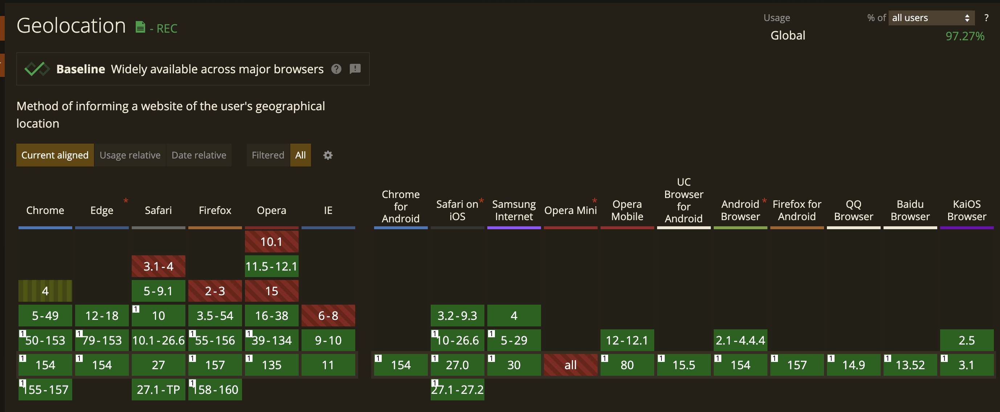

# GeoLocation API
- 웹 브라우저에서 사용자의 지리적 정보를 얻을 수 있는 API(위도, 경도, 고도, 이동속도, 이동방향 등등)
- 사용되는 소스: GPS, GLONASS, Wi-Fi, IP주소, 자이로스코프 센서, 나침판 센서
- 사용자의 위치 정보 권한을 확인 받고 진행함
### 지원되는 브라우저

### 소스코드
#### 현재 위치 얻기
```js
    navigator.geolocation.getCurrentPosition()
```
#### 장소가 바뀔 때마다 자동으로 새로운 위치를 사용해 호출함 함수 등록
```js
    navigator.geolocation.watchPosition()
```
